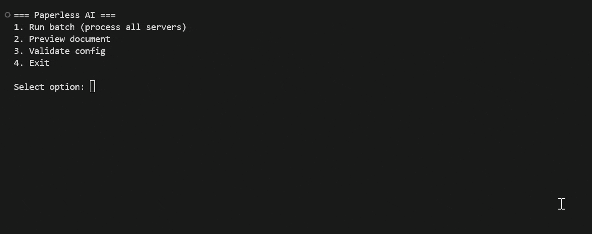

# Paperless Intelligence

AI-powered document processor for Paperless-ngx that uses Ollama to generate document titles and OCR content.

## Features

- **Multi-server support**: Process documents from multiple Paperless-ngx instances
- **Intelligent PDF classification**: Distinguishes between original digital PDFs, searchable scanned PDFs, and image-only PDFs
- **Automatic fallback**: Retries with a smaller/faster model on timeout
- **Preview mode**: Review proposed titles before saving

## Disclaimer
 Almost all of the code has been created using ChatGPT 5.3 Codex, ChatGPT 5.4 and MiniMax M2.5. Aka technically this project is a slop. A working slop, but take it as you will.

## Preview
<p align="center">
  
</p>


## Requirements

- Python 3.11+
- [Paperless-ngx](https://github.com/paperless-ngx/paperless-ngx) instance(s)
- [Ollama](https://github.com/ollama/ollama) server with vision-capable model
- Optional: PyMuPDF for strict PDF classification

## Installation

```bash
# Clone the repository
git clone https://github.com/your-repo/paperless-intelligence.git
cd paperless-intelligence

# Install dependencies
pip install pydantic pydantic-settings httpx

# Optional: for strict PDF classification
pip install PyMuPDF
```

## Configuration

Create a `.env` file (see `.env.example` for template):

```env
# Server 1
PAPERLESS_SERVER_NAME=server1
PAPERLESS_SERVER_URL=http://localhost:8000
PAPERLESS_SERVER_TOKEN=your-token

# Server 2 (optional)
PAPERLESS_SERVER_2_NAME=server2
PAPERLESS_SERVER_2_URL=http://localhost:8001
PAPERLESS_SERVER_2_TOKEN=your-token

# Add more servers as needed: _3, _4, etc.

# Ollama
OLLAMA_BASE_URL=http://localhost:11434
OLLAMA_MODEL=qwen3.5:27b
OLLAMA_FALLBACK_MODEL=qwen3.5:latest

# Processing
MAX_RETRIES=2
REQUEST_TIMEOUT_SECONDS=240
```

### Server Configuration

Each server needs:
- `name`: Unique identifier (used in logs)
- `base_url`: Paperless-ngx URL
- `api_token`: API token from Paperless-ngx (User profile -> Tokens)

### Ollama Models

- **Primary model** (`ollama_model`): Vision-capable model for OCR and title generation (e.g., `qwen3.5:27b`, `llama3.2:90b`)
- **Fallback model** (`ollama_fallback_model`): Smaller model for retry on timeout

### Metadata Requirements

Each Paperless-ngx instance needs a custom field:
- **Name**: `AI-Processing Status`
- **Type**: Select
- **Options**: `Queued`, `Done`, `Failed`

## Usage

### Interactive Mode (default)

```bash
python paperless-intelligence.py
```

Shows a menu with options:
1. Run batch (process all servers)
2. Preview document
3. Bootstrap (validate config)
4. Exit

### Command Line Mode

```bash
python paperless-intelligence.py validate   # Validate config
python paperless-intelligence.py run         # Process all servers
python paperless-intelligence.py preview 123  # Preview document
python paperless-intelligence.py preview 123 --server diil  # With server selection
```

## Commands

| Command | Description |
|---------|-------------|
| `bootstrap` | Validate configuration and required custom fields |
| `run` | Process all servers, handling documents not marked `Done` |
| `preview <id>` | Preview proposed title for a document before saving |

## PDF Classification

The tool analyzes original PDFs to determine processing mode:

| PDF Type | Detection Method | Processing |
|----------|------------------|------------|
| Original digital | Contains substantial text, no dominant images | Use Paperless text for title only |
| Searchable scanned | Contains text + images | Run OCR, overwrite content |
| Image-only | Images dominate, minimal text | Run OCR, overwrite content |
| Uncertain | Cannot determine | Fall back to OCR |

## Architecture

```
paperless_intelligence/
├── __init__.py      # Package entry
├── config.py        # Settings (Pydantic + .env)
├── api.py           # HTTP clients (httpx)
├── types.py         # Data classes
├── processor.py     # Core processing logic
└── cli.py           # CLI commands
```

## License

MIT
